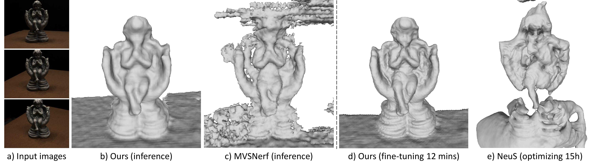

# SparseNeuS: Fast Generalizable Neural Surface Reconstruction from Sparse Views [ECCV2022]
We present a novel neural surface reconstruction method, called SparseNeuS, which can generalize to new scenes and work well with
sparse images (as few as 2 or 3).



## [Project Page](https://www.xxlong.site/SparseNeuS/) | [Paper](https://arxiv.org/pdf/2206.05737.pdf) 

## Setup

### Dependencies
- pytorch
- [torchsparse](https://github.com/mit-han-lab/torchsparse)
- opencv_python
- trimesh
- numpy
- pyhocon
- icecream
- tqdm
- scipy
- PyMCubes

### Dataset
- DTU Training dataset. Please download the preprocessed DTU dataset provided by [MVSNet](https://drive.google.com/file/d/1eDjh-_bxKKnEuz5h-HXS7EDJn59clx6V/view). As stated in the paper, we preprocess the images to obtain the masks about the "black empty background" to remove image noises. The preprocessed masks can be downloaded [here](https://connecthkuhk-my.sharepoint.com/:u:/g/personal/xxlong_connect_hku_hk/EW_v7RA73HNEquScVtNJ34gB4hYlRfEatW4TOg086F0_Lg?e=3SKiif). Training without the masks will not be a problem, just ignore the "masks" in the dataloader.
- DTU testing dataset. Since our target neural reconstruction with sparse views, we select two set of three images from the 15 testing scenes (same as [IDR](https://github.com/lioryariv/idr)) for evaluation. Download our prepared [testing dataset](https://connecthkuhk-my.sharepoint.com/:u:/g/personal/xxlong_connect_hku_hk/EU22HEv48nRLnnnliRvJNA0BILozsMLbhsnMQh1WZLY5kg?e=Lh7kWM).


### Easy to try
Just run the provided bash file to get the teaser result.
```shell
bash ./sample_bashs/dtu_scan118.sh
```

### Training 
Our training has two stages. First train the coarse level and then the fine level.
```shell
python exp_runner_generic.py --mode train --conf ./confs/general_lod0.conf
python exp_runner_generic.py --mode train --conf ./confs/general_lod1.conf --is_continue --restore_lod0
```

### Finetuning
The reconstructed results generated by generic model can be further improved using our consistency-aware fine-tuning scheme.

The parameters 'visibility_beta' and 'visibility_gama' control the consistency level, 
which decide how much regions of the scene are kept. 

For few cases with weak texture or noises, improper 'visibility_beta' and 'visibility_gama' will easily cause empty result.
To make the optimization more robust, the 'visibility_weight_thred' is introduced to avoid all regions of the scene are discarded.
```shell
#!/usr/bin/env bash
python exp_runner_finetune.py \
--mode train --conf ./confs/finetune.conf --is_finetune \
--checkpoint_path ./weights/ckpt.pth \
--case_name scan118  --train_imgs_idx 0 1 2 --test_imgs_idx 0 1 2 --near 700 --far 1100 \
--visibility_beta 0.025 --visibility_gama 0.010 --visibility_weight_thred 0.7 0.6 0.5
```

### Results
You can download the [DTU results]((https://connecthkuhk-my.sharepoint.com/:f:/g/personal/xxlong_connect_hku_hk/EpvCB9YC1FZEtrsrbEkd8AwBGdnymfTQLJIdXFIeIOcqsw?e=3hb9Zn)) and [BMVS results](https://connecthkuhk-my.sharepoint.com/:f:/g/personal/xxlong_connect_hku_hk/EpLOwBek671NmgzmmLresT0Bt9JKgIYBkHogeQsukzfttQ?e=rodRih) of the paper reports here.


## Citation

Cite as below if you find this repository is helpful to your project:

```
@article{long2022sparseneus,
          title={SparseNeuS: Fast Generalizable Neural Surface Reconstruction from Sparse views},
          author={Long, Xiaoxiao and Lin, Cheng and Wang, Peng and Komura, Taku and Wang, Wenping},
          journal={ECCV},
          year={2022}
        }
```

## Acknowledgement

Some code snippets are borrowed from [IDR](https://github.com/lioryariv/idr), [NeuS](https://github.com/Totoro97/NeuS) and [IBRNet](https://github.com/googleinterns/IBRNet). Thanks for these great projects.
